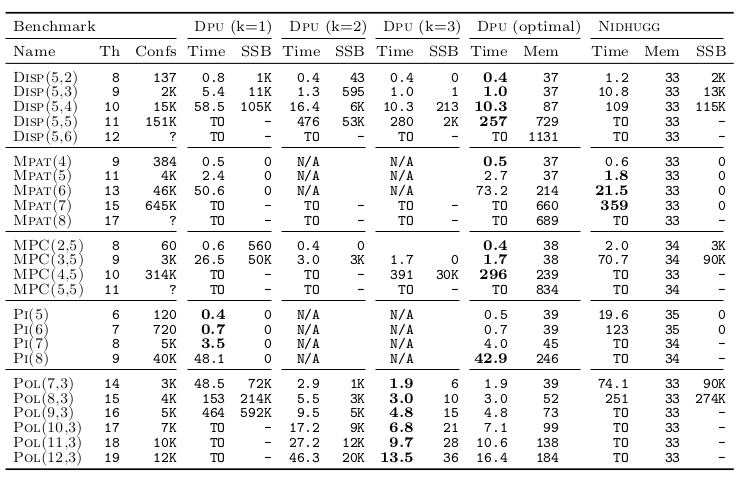

## Reproducing Section 6.1: Table 1, Comparing QPOR with SDPOR

Navigation: [Table of contents], [Previous section], [Next section]

[Table of contents]: 1-intro.md#index
[Previous section]: 2-compiling-tools.md
[Next section]: 4-section-6.2.md

DPU is a testing tool that explores the state space of the program by building a
so-called **Prime-Event Structure** (PES), also known as Unfolding of the program.
Each "test" corresponds to a different scheduling, or **interleaving** of the
threads in the program. When the interleaving is viewed as a partially-ordered
set of events we call it **configuration**.

A **maximal configuration** is a maximal execution, that is, one that runs the
program beginning to end.

A **Sleep-Set Blocked** (SSB) execution is BLA. FIXME.

### Benchmarks

All the input files for the benchmarks are stored in the `benchmarks/` directory.


| Instance   | Benchmark                      | Parameters
| -----------|--------------------------------| ------------------------
| Disp(5,2)  | `benchmarks/dispatcher.c`      | `PARAM1=5 PARAM2=2`
| Disp(5,3)  | `benchmarks/dispatcher.c`      | `PARAM1=5 PARAM2=3`
| Disp(5,4)  | `benchmarks/dispatcher.c`      | `PARAM1=5 PARAM2=4`
| Disp(5,5)  | `benchmarks/dispatcher.c`      | `PARAM1=5 PARAM2=5`
| Disp(5,6)  | `benchmarks/dispatcher.c`      | `PARAM1=5 PARAM2=6`
| Mpat(4)    | `benchmarks/mpat.c`            | `PARAM1=4`
| Mpat(5)    | `benchmarks/mpat.c`            | `PARAM1=5`
| Mpat(6)    | `benchmarks/mpat.c`            | `PARAM1=6`
| Mpat(7)    | `benchmarks/mpat.c`            | `PARAM1=7`
| Mpat(8)    | `benchmarks/mpat.c`            | `PARAM1=8`
| Mpc(2,5)   | `benchmarks/multiprodcon.c`    | `PARAM1=2 PARAM2=2`
| Mpc(3,5)   | `benchmarks/multiprodcon.c`    | `PARAM1=3 PARAM2=3`
| Mpc(4,5)   | `benchmarks/multiprodcon.c`    | `PARAM1=4 PARAM2=4`
| Mpc(5,5)   | `benchmarks/multiprodcon.c`    | `PARAM1=5 PARAM2=5`
| Pi(5,2000) | `benchmarks/pi/pth_pi_mutex.c` | `PARAM1=5 PARAM2=2000`
| Pi(6,2000) | `benchmarks/pi/pth_pi_mutex.c` | `PARAM1=6 PARAM2=2000`
| Pi(7,2000) | `benchmarks/pi/pth_pi_mutex.c` | `PARAM1=7 PARAM2=2000`
| Pi(8,2000) | `benchmarks/pi/pth_pi_mutex.c` | `PARAM1=8 PARAM2=2000`
| Pol(7,3)  | `benchmarks/poke.c`            | `PARAM1=7 PARAM2=3`
| Pol(8,3)  | `benchmarks/poke.c`            | `PARAM1=8 PARAM2=3`
| Pol(9,3)  | `benchmarks/poke.c`            | `PARAM1=9 PARAM2=3`
| Pol(10,3)  | `benchmarks/poke.c`            | `PARAM1=10 PARAM2=3`
| Pol(11,3)  | `benchmarks/poke.c`            | `PARAM1=11 PARAM2=3`
| Pol(12,3)  | `benchmarks/poke.c`            | `PARAM1=12 PARAM2=3`


- say where are the benchmarks (sees how I did it for section 6.2).
- put a table similar to the one I have used in section 6.2, explaining how
  parameters are passed to `cpp` to instantiate the benchmark.
- FIXME: done, I need to check with the scripts

### The tools

- Precompiled binaries are made available to the reviewersr
- Say where are the binaries and display the command and console output if you
  run them with `--version`.

### Generating Table 1

In order to build Table 1 from the paper (shown below), just run from the top directory::
```sh
make sec6.1-table1
```
This will execute the script `script/run-table1.sh` , which in turn will generate a folder  `logs.XXXXX`
(XXXXX is the date time of running moment) inside of the folder `sec6.1-table1` with multiple log files.
It also creates a folder `logs` with files linked to those in the latest folder `logs.XXXXX`.
In the folder `logs`, for each benchmarks with a pair of parameters, we will find one information
files (file `.i`), multiple `.txt` files where each corresponds one DPU running of the benchmark with a
*k-partial algorithm* (k=0,1,2,3) and one `.txt` file for Nidhugg running on the benchmark.
For example, for the benchmark `dispatcher.c` with 5 servers and 2 requesters, we have these files:

* `dispatch-serv5_reqs2.i`
* `dispatch-serv5_reqs2_dpu_alt0.txt`
* `dispatch-serv5_reqs2_dpu_alt1.txt`
* `dispatch-serv5_reqs2_dpu_alt2.txt`
* `dispatch-serv5_reqs2_dpu_alt3.txt`
* `dispatch-serv5_reqs2_nidhugg.txt`

In the same folder, we also find a `LOG.rst` file which stores all details about running the scripts as we see
on the screen and a `TABLE.tex` which puts all the data in LaTex table (the same as Table 1 in the table).

To produce those results, in script file `runtable1.sh`, we use pre-compiled version of DPU (available at `dist/dpu/bin/dpu`)
to perform the following task:
1. **Preproceed benchmarks** by one of `generate_bench_*()` functions, e.g `generate_bench_selection()` for Table 1 above,
in which we call `cpp` on the benchmarks with suitable -D macros to instantiate the parametric benchmarks.
2. **Run DPU** by function `runall_dpu()`, then generate log `.txt` files with the output of DPU.
3. **Run NIDHUGG** by `runall_nidhugg()` on the benchmarks and generate a log file, e.g `dispatcher-serv5_reqs2_nidhugg.txt`
in the example above, in log folders.
4. ** Parse log files** and **generate LaTex table** in `TABLE.tex` with the function `dump_latex()` which is displayed as follows:

FIXME: Result Table here

Although run times and memory consumption sizes are not identical to those
shown in the paper, observe that the variations are usually quite small.
For the record, the table as presented in the paper looked like this:



The set of experiments executes in about 4h15 with no errors. 

### Running the Tools by Hand

- Give the command line to invoke DPU or nidhugg by hand on a simple example.
- Explain briefly the output.

The binary tools are located in subfolders of the `dist` directory.

The documentation of the command-line interface of DPU is given by:
```sh
./dist/dpu/bin/dpu --help
Usage: dpu FILE.{c,i,bc,ll} ANALYZEROPTS -- PROGRAMOPTS
```

For instance :
```sh
./dist/dpu/bin/dpu benchmarks/dispatcher.c
```

The parameters are passed as pre-compiler options, e.g. `-DPARAM1=5`.

An interesting parameter here is the k parameter (`-k N`): it provides how close to optimal POR the tool will be. If N=0, DPU will run optimal DPO, otherwise if will use N-partial alternatives. 

In a similar way, the documentation of the command-line interface of Nidhugg is given by:

```sh
./dist/nidhugg/bin/nidhuggc --help
Usage: ./dist/nidhugg/bin/nidhuggc [[COMPILER/NIDHUGGC OPTIONS --] NIDHUGG/NIDHUGGC OPTIONS] FILE [-- [PROGRAM ARGUMENTS]]
```

In particular, Nidhugg needs to be provided a memory model. For instance, it can run with:

```sh
./dist/nidhugg/bin/nidhuggc --c -sc benchmarks/dispatcher.c
```

### Compiling the Tools by Hand

Documentation on how to compile the tools is given in the [Previous section].
