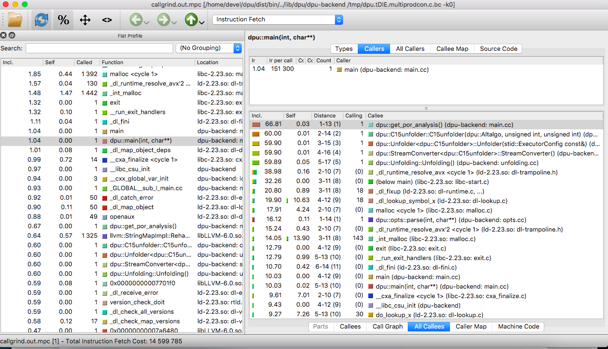

## Reproducing Section 6.4: Profiling DPU

Navigation: [Table of contents], [Previous section]

[Table of contents]: 1-intro.md#index
[Previous section]: 5-section-6.3.md

Section 6.4 of the paper states a number of experimental conclusions about
the percentage of the run time spent in the most important sub-procedures
implemented by DPU.
In the sections below we address each of the claims made in paper.

We use [Callgrind] and [KCachegrind] to validate our statements. DPU comes with
a handy commandline option `--callgrind` which, when passed to DPU, will run DPU
under `callgrind`.

The benchmarks used for these experiments are as follows:

```sh
$ cd sec6.4-profiling/
$ ls -l
[LIST HERE]
```

We run DPU in with optimal POR exploration (`-k 0`).
For simplicity of evaluation we include the `callgrind.out.*` files generated by
`callgrind` when DPU is ran on the above benchmarks. The files are available in
the [folder callgrind.out](callgrind.out), but can be generated as follows:

```sh
dpu ./cav18/bench/multiprodcon.c -k 0 --callgrind
```

[Callgrind]: http://valgrind.org/docs/manual/cl-manual.html
[KCachegrind]: http://kcachegrind.sourceforge.net/

### Callgrind + KCachegrind Premiere

After running **dpu** on benchmarks with *--callgrind*, you can read `callgrind.out` profiling
files using a text editor, but **KCacheGrind** will be more useful to view them visually.
You can launch **KCacheGrind** using command line, providing your system installed it.
Here is the command to view the profilling file `callgrind.out.mpc`  achieved by the command
running DPU on the benchmark *multiprodcon.c*
```sh
kcachegrind callgrind.out.mpc
```
Note that to be able to launch GUI of **kcachegrind** in your local, you should log in our virtual machine
with:
```sh
ssh - X  our link
```

The first screen presents a list of all the profiled procedures as the image below


* The left panel displays major functions in descendant order where you are highlighted
at main function by default.
* The details of selected function (in this case, it is main) are  in
the right panel which is devided in two parts: upper one for callers and the
lower for callees.



We here concern the callees of *main* function. Look at the graph in the *Call Graph* tab, we can
see the hierachy of calls from main while its performance details are shown in
*All Calles* tab. Among the major callees, `dpu::get_por_analysis()` counts for
<<<<<<< Updated upstream
62.73%, while `dpu::opts::parse(...)` does 15.27% of the run time of `dpu::main(...)`.
Many other minor functions are inlined.

### Claim 1: Program executing time

DPU spends between 30% and 90% (average 65%) of the run time executing the program
To execute a program, *dpu* first loads bitcode
Profiling the benchmarks, we get the table below on program executing time:

**Cesar**: Huyen, please fix this table so that it's readable in the editor, the
columns are messed up.

| Benchmarks  |  Configure POR analysis |
| --------------- | ------------------------       |
| DISP (5,2)      |  62.74       |
| DISP (5,3)      |  62.74       |
| DISP (5,4)      |  62.74       |
| MPC()            |  64.55       |
| PI(5)               | 64.55        |
| MPAT()           | 64.55        |
| SPAT              | 64.55        |

The time to configure the analysis by `get_por_analysis` and parse arguments didn't vary a lot. The most important information is about run() function is not found anywhere.
We cannot say: "This supports what we mention in Section 6.4 of the paper about program executing time."

### Claim 2:  Computing alternatives
| Benchmarks  |  Add events | Compute conflicting extension |
| --------------- | -------------- | ------------------------------------|
| DISP (5,2)      |                      |                  |
| DISP (5,3)      |                      |                  |
| DISP (5,4)      |                      |                  |
| MPC()            |                      |                  |
| PI(5)               |                      |                  |
| MPAT()           |                      |
| SPAT              |                      |


### Claim 3: Building and Exploring combs.
| Benchmarks  |  Buidl comb | Explore comb |
| --------------- | -------------- | --------------------|
| DISP (5,2)      |                      |
| DISP (5,3)      |                       |
| DISP (5,4)      |                        |
| MPC()            |                        |
| PI(5)               |                      |
| MPAT()           |                     |
| SPAT              |                       |

