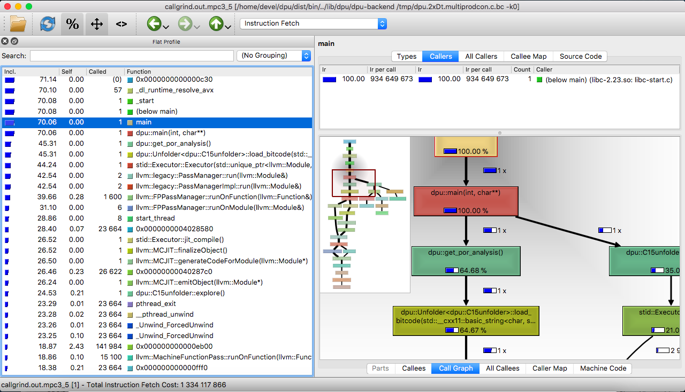
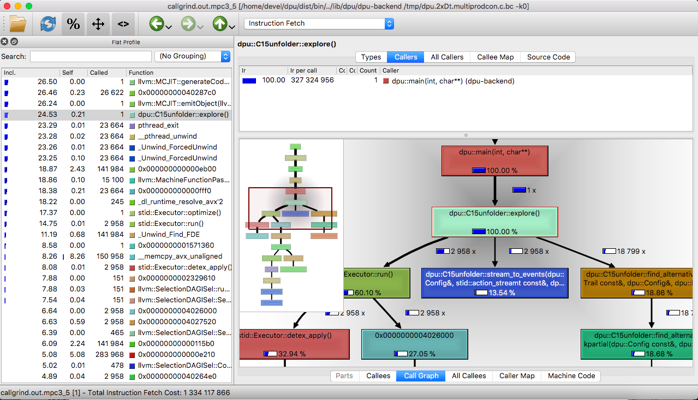
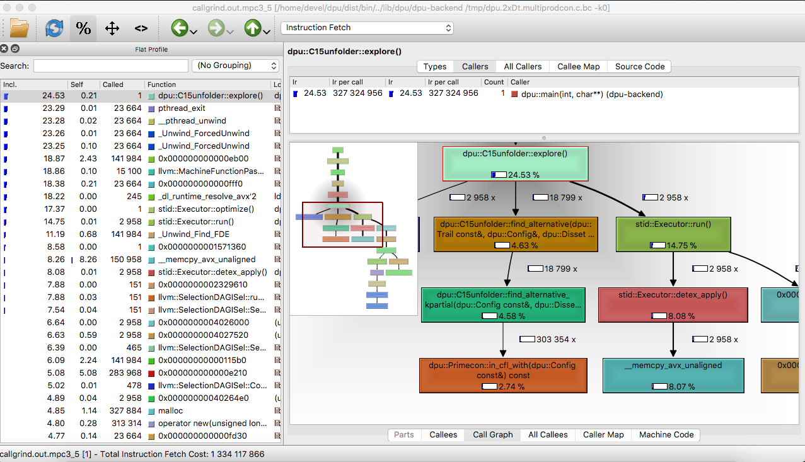

## Reproducing Section 6.4: Profiling DPU

Navigation: [Table of contents], [Previous section]

[Table of contents]: 1-intro.md#index
[Previous section]: 5-section-6.3.md

Section 6.4 of the paper states a number of experimental conclusions about
the percentage of the run time spent in the most important sub-procedures
implemented by DPU.
In the sections below we address each of the claims made in paper.

We use [Callgrind] and [KCachegrind] to validate our statements. DPU comes with
a handy commandline option `--callgrind` which, when passed to DPU, will run DPU
under `callgrind`.

The benchmarks used for these experiments are as follows:

```sh
$ cd sec6.4-profiling/
$ ls -l
[LIST HERE]
```

We run DPU in with optimal POR exploration (`-k 0`).
For simplicity of evaluation we include the `callgrind.out.*` files generated by
`callgrind` when DPU is ran on the above benchmarks. The files are available in
the [folder callgrind](https://github.com/cesaro/dpu-cav18-exp/tree/master/sec6.4-profiling/callgrind.out),
but can be generated as follows:

```sh
dpu ./cav18/bench/multiprodcon.c -k 0 --callgrind
```

[Callgrind]: http://valgrind.org/docs/manual/cl-manual.html
[KCachegrind]: http://kcachegrind.sourceforge.net/

### Callgrind + KCachegrind Premiere
To be able to run DPU under `callgrind` and view its output, you need to get them installed in
your Linux machine:
```sh
apt-get install valgrind kcachegrind
```
Now, suppose that you are in folder `experiments/cav18/bench/`. You type
```sh
dpu multiprodcon.c -k0 --callgrind
```
to run DPU on benchmark `multiprodcon.c` under `callgrind`. After executing this command, you get
a callgrind output file named like `callgrind.out.X` with X is a number in the current path.
For better readabillity, we changed it into `callgrind.out.mpc3_5` (3 and 5 correspond
to two parameters we set in `multiprodcon.c` file) for this benchmark.
Callgrind output file could be read using a text editor, but **KCacheGrind** will be more useful
thank to its visual view. **KCacheGrind** is launched using command line, providing it is already installed.
Here is the command to view the profilling file `callgrind.out.mpc3_5`
```sh
kcachegrind callgrind.out.mpc3_5
```
Note that to be able to launch GUI of **kcachegrind** in your local Linux machine while working on
a virtual machine, you should connect to it with:
```sh
ssh - X  VM-link
```
The first screen presents a list of all the profiled procedures as the image below:



* The left panel displays major functions in order where you are highlighted
at main function by default. You can search in the top left box for require function.
* The details of selected function (Here is `dpu::C15unfolder::explore()` we
have searched for) are  in the right panel which is devided in two parts: the upper is
for callers where we can see the `dpu::main(int,char**)` and the lower is for callees
where we mainly concern Call Graph and All Callees tabs.



The  *Call Graph* tab shows us  the hierachy of major called functions together with their
performance in term of percentage or the number of instruction fetch cost (Click on the icon
 to switch the display choice).  In our example above, you see the functions'
run time in percentage as we chose the icon. We witness three sub-functions : `stid::Executor::run()` takes 60.10%,
`dpu::C15unfolder::stream_to_events()` takes 13.54% and
`dpu::C15unfolder::find_alternative()` takes 18.86% the run time of their parent of
`dpu::C15unfolder::explore()`.
In Call Graph, you can choose to display the percentage of a function relative to its parent or relative
to overall run time by click or unclick on the icon  in the tool bar.  In this example,
it is relative to that of functions' parents.
Many other minor functions are skipped, but you can find some of them in the list in *All Callees* tab
or just do a search in the left panel. For example, we found in this image below the function
`dpu::C15unfolder::enumerate_combination()` with only 0.44% of
`dpu::C15unfolder::explore()` 's run time which is not displayed in Call Graph.


### The most relevant C++ functions
In the sections below, we will refer to various tasks such as executing program under analysis, computing alternatives, etc.
In this section, we explain the correspondence between these tasks and the C++ functions implementing them in DPU.
* _Main procedure of DPU_: corresponds to function `dpu::C15unfolder::explore()`.  It directly works on
the program under analysis including executing the program, building event structure, computing alternatives, etc.
* _Running the program under analysis_: corresponds to function `stid::Executor::run()` which calls the front end Steroids
to execute the target program as a C multithreaded program and produces a stream of actions.
* _Adding events to event structure_: corresponds to function `dpu::C15unfolder::stream_to_events()` which converts the
stream of actions achieved from `stid::Executor::run()` into events in event structure called a _maximal configuration_.
* _Adding spikes to the comb_: corresponds to `Comb::add_spike()` which builds the comb by adding appropriate
events in spikes.
* _Checking conflict_: Function `dpu::Primecon::in_cfl_with()`  checks the conflict between each event in spikes with
events in another set.
* _Computing conflicting extensions_: Function `dpu::C15unfolder::compute_cex()` adds a set of events called
conflicting extensions to event structure when it finds.
* _Exploring the comb_: corresponds to `dpu::C15unfolder::enumerate_combination()` which enumerates all possible combinations
over a comb to find out a qualified one.
* _Reset the comb_: `Comb::clear()` sets the comb to empty.
* _Taking out event from spike_: `Spike::pop_back()` pops out one event from a spike.

### Claim 1:  DPU spends between 30% and 90% of the time running the program under anlaysis.
Running DPU under `callgrind` for all the benchmarks, we select some representative one for each benchmark
to show in the table below. The percentage shown is the run time of function  `stid::Executor::run()` compared
to that of `dpu::C15unfolder::explore()`. The lowest is 34.43% for the benchmark `poke.c` with 7 threads and 3 iterations
while the highest is on benchmark `pth_pi_mutex.c` with 5 threads and 40000 iterations.

| Benchmarks  | Run program (%) |
| ------------     | --------  |
| DISP (5,3)      |  47.08   |
| MPC(3,5)       |  60.10   |
| PI(5,40000)    |  91.07   |
| MPAT(6)         |  54.97   |
| POL(7,3)        |  34.43   |

These representatives support what we mention in Section 6.4 of the paper about program executing time.

### Claim 2: DPU spends in average 65% of the time running the program under anlaysis
Look at the table above, we can trivially compute the average of program executing time is approximately 60%.
Based on results of running all benchmark with various parameters as shown in Table 1 in the paper, we get the average of 65%.

### Claim 3: DPU spends between 15% and 30% of the time adding events to the event structure.

| Benchmarks  |  Add events (%) |
| --------------- | ------------------ |
| DISP (5,3)      |    23.00              |
| MPC(3,5)       |    13.54              |
| PI(5,40000)    |    6.60                |
| MPAT()           |    24.52              |
| POL(7,3)        |    27.76              |

To the run time of `dpu::C15unfolder::explore()`, that of `dpu::C15unfolder::stream_to_events()`
counts for 13.54% at least and 27.76% at most as shown in the table above which means they are in the range
of 15% and 30% as claimed in the paper. There is only one abnorm with 6.6% for benchmark PI with 5 threads
and 40000 iterations.


### Claim 4: DPU spends between 1% and 50% of the time building spikes of a new comb

Building a new comb includes reseting it to empty first, then adding spikes, removing those are in conflict
with some other events. Hence, the time of building a new comb is the sum of the run time of `Comb::add_spike()`,
`dpu::Primecon::in_cfl_with()`, `Comb::clear()` and `Spike::pop_back()`. Among them, `Comb::clear()`
and `Spike::pop_back()` normally have tiny run time, so we count the time of building a comb mainly on
`Comb::add_spike()` and `dpu::Primecon::in_cfl_with()`.
It is a little bit tricky to compute the percentage of these two functions compared to `dpu::C15unfolder::explore()`.



Unclick on  to display the time of functions relative to overall run time (not to their parents), as you see
the image above. `dpu::Primecon::in_cfl_with()` takes 2.74% while  `dpu::C15unfolder::explore()` takes 24.53%
of the overall run time that means `dpu::Primecon::in_cfl_with()`  counts for `2.74/24.53 = 11.17% ` the time of
`dpu::C15unfolder::explore()`. Similarly, we can compute that `Comb::add_spike()` takes `1.04/24.53 = 4.24%`.
Hence, building a comb takes around 15.41% in total.

Do the same for the rest, we get the table below:

| Benchmarks  | Add spike (%)| Check conflict (%) | Build comb (%) |
| --------------- | -------------- | ----------------------- | ----------------- |
| DISP (5,3)      |    6.94          |      11.22                    |       18.16       |
| MPC()            |    4.24           |      11.17                  |      15.41           |
| PI(5,40000)    |     0.16          |       0                        |     0.16           |
| MPAT()           |    5.94           |        4.6                    |    10.54         |
| POL(7,3)        |     7.66         |       19.7                   |    27.36         |

Except benchmark PI, all the others gives us the time of building a new comb in the range of 1% to 50%.

### Claim 5: DPU spends less than 5% of the time solving the comb

Benchmarks  |   Explore comb (%) |
| -------------- |  --------------- |
| DISP (5,3)    |    1                 |
| MPC()          |     0.5             |
| PI(5,40000)  |     0.2             |
| MPAT()         |     0.74           |
| POL(7,3)      |     1                |

### Claim 6: DPU spends less than 5% of the time computing conflicting extensions

| Benchmarks  |  Compute conflicting extension (%) |
| ---------------- | --------------------------------------- |
| DISP (5,3)      |    3.9              |
| MPC(3,5)       |   3.55             |
| PI(5,40000)    |   0.97             |
| MPAT()           |   3.4               |
| POL(7,3)        |   2.67             |

---------------------------------------
### Claim 2:  Computing alternatives
The seconde major procedure of DPU is computing alternatives including two sub main procesures:
prepare the event structure (maximal configuration and conflicting extension)  and find an alternative.
Preparing event structure does:
* Adding events to the event structure: stream of actions achieved from `stid::Executor::run()`
are converted into events, then added to the unfolding. This work corresponds to the  function
`dpu::C15unfolder::stream_to_events()` , a callee of `dpu::C15unfolder::explore()`
* Computing conflicting extensions: We have function `dpu::C15unfolder::compute_cex()`
to do that work which usually takes a tiny amount of time to finish.

| Benchmarks  |  Add events (%) | Compute conflicting extension (%) |
| ----------------| ------------------| ----------------------------------------|
| DISP (5,3)      |    23.00               |    3.9               |
| MPC(3,5)       |    13.54               |    3.55             |
| PI(5)               |    21.63               |    3.31             |
| PI(6)               |    22.58               |    8.94             |
| MPAT()           |    24.52               |    3.4               |
| POL(7,3)        |    27.76               |    2.67             |

The table shows adding events to the event structure  counts for around 15% to 30% while
computing conflicting extensions normally takes less than 5%, except benchmark PI with 6 threads.

### Claim 3: Find an alternative
To find an alternative, we exploit the *comb* whose spikes are sets of events immediately conflicts with
events in disable set. To evaluate the alternative finding performance, we look for functions:
* Building the comb: reseting the comb `Comb::clear()`, adding spikes `Comb::add_spike()`, checking if each
element in a spike is in conflict with some event in the configuration `dpu::Primecon::in_cfl_with()` and
poping up events from spikes `pop_back()` . Among them,  `Comb::clear()` and `pop_back()`are usually tiny,
so often inlined in **Kcachegrind** view.
* Searching for solutions in the comb  by the function `dpu::C15unfolder::enumerate_combination()`.

We get some representative results in the table below:

| Benchmarks  |  Build comb (%) | Explore comb (%) |
| --------------- | -------------- | ---------------- |
| DISP (5,3)      |   18.01          |  1           |    ok
| MPC()            |   15.28          |  0.5        | ok
| PI(5)               |    0.75           |  0.5        | ok
| PI(6)               |    1.62           |  0.5        | ok
| MPAT()           |    13.97         |  0.74       ok
| POL(7,3)        |    35.02         |  1           | ok

The results conforms to the conclusion in Section 6.4 that building the spikes of a new
comb varies from 1% to 50% and searching for solutions in the comb is less than 5%
(They are here even less than 1%).


