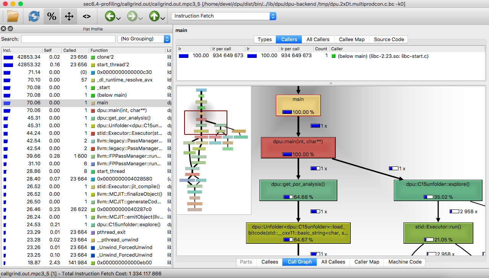

## Reproducing Section 6.4: Profiling DPU

Navigation: [Table of contents], [Previous section]

[Table of contents]: 1-intro.md#index
[Previous section]: 5-section-6.3.md

Section 6.4 of the paper states a number of experimental conclusions about the
percentage of the run time spent in the most important sub-procedures
implemented by DPU.  In the sections below we address each of the claims made in
paper.

We use [Callgrind] and [KCachegrind] to validate our statements.
Callgrind is a profiling tool. When a program is executed under Callgrind, it
will generate a file `callgrind.out.<PID>` with run time information of each
function of the program.  KCachegrind is just a visualization tool for the
file `callgrind.out.<PID>`.

DPU comes with a handy commandline option `--callgrind` which, when passed to
DPU, will run DPU under `callgrind`.

We ran DPU in with optimal POR exploration (`-k 0`) on a number of benchmarks
and generated the `callgrind.out.*` files included in the folder

```
sec6.4-profiling/callgrind.out/
```

These files can also be generated using the following commands.  From the root
of the project type:

```sh
./dist/dpu/bin/dpu benchmarks/dispatcher.c -DPARAM1=5 -DPARAM2=3 -k 0 --callgrind
./dist/dpu/bin/dpu benchmarks/multiprodcon.c -DPARAM1=3 -DPARAM2=5 -k 0 --callgrind
./dist/dpu/bin/dpu benchmarks/pi/pth_pi_mutex.c -DPARAM1=5 -DPARAM2=40000 -k 0 --callgrind
./dist/dpu/bin/dpu benchmarks/mpat.c -DPARAM1=6  -k 0 --callgrind
./dist/dpu/bin/dpu benchmarks/poke.c -DPARAM1=7 -DPARAM2=3 -k 0 --callgrind

```

[Callgrind]: http://valgrind.org/docs/manual/cl-manual.html
[KCachegrind]: http://kcachegrind.sourceforge.net/

### Using KCachegrind

We explain the basic use of KCachegrind using an example. Recall that
KCachegrind is a graphical program, so you will need to:

* Connect to the provided machine from a Linux Machine.
* Connect to the provided machine using `ssh -X`.

From the root of the repository, run

```sh
kcachegrind sec6.4-profiling/callgrind.out/callgrind.out.mpc3_5
```

This will take few seconds to launch (alternatively you could install
KCachegrind in your own machine and visualize the `callgrind.out.*` files).
The first screen presents a list of all the profiled procedures as the image
below:



* The left panel displays major functions in order where you are highlighted
at main function by default. You can search in the top left box for require function.
* The details of selected function (Here is `dpu::C15unfolder::explore()` we
have searched for) are  in the right panel which is devided in two parts: the upper is
for callers where we can see the `dpu::main(int,char**)` and the lower is for callees
where we mainly concern Call Graph and All Callees tabs.


The  *Call Graph* tab shows us  the hierachy of major called functions together with their
performance in term of percentage or the number of instruction fetch cost (Click on the icon
 to switch the display choice).  In our example above, you see the functions'
run time in percentage as we chose the icon. We witness three sub-functions : `stid::Executor::run()` takes 60.10%,
`dpu::C15unfolder::stream_to_events()` takes 13.54% and
`dpu::C15unfolder::find_alternative()` takes 18.86% of the run time of their parent
`dpu::C15unfolder::explore()`.
In Call Graph, you can choose to display the percentage of a function relative to its parent or relative
to overall run time by clicking/unclicking on the icon  in the tool bar.  In this example,
it is relative to that of function' parents.
Many other minor functions are skipped, but you can find some of them in the list in *All Callees* tab
or just do a search in the left panel. For example, we found in the image below the function
`dpu::C15unfolder::enumerate_combination()` with only 0.44% of the run time of
`dpu::C15unfolder::explore()` which is not displayed in Call Graph.


### The most relevant C++ functions
In the sections below, we will refer to various tasks such as executing program under analysis, computing alternatives, etc.
In this section, we explain the correspondence between these tasks and the C++ functions implementing them in DPU.
* __Main procedure of DPU__: corresponds to function `dpu::C15unfolder::explore()`.  It directly works on
the program under analysis including executing the program, building event structure, computing alternatives, etc.
* __Running the program under analysis__: corresponds to function `stid::Executor::run()` which calls the front end Steroids
to execute the target program as a C multithreaded program and produces a stream of actions.
* __Adding events to event structure__: corresponds to function `dpu::C15unfolder::stream_to_events()` which converts the
stream of actions achieved from `stid::Executor::run()` into events in event structure called a _maximal configuration_.
* __Adding spikes to the comb__: corresponds to `Comb::add_spike()` which builds the comb by adding appropriate
events in spikes.
* __Checking conflict__: Function `dpu::Primecon::in_cfl_with()`  checks the conflict between each event in spikes with
events in another set.
* __Computing conflicting extensions__: Function `dpu::C15unfolder::compute_cex()` adds a set of events called
conflicting extensions to event structure when it finds.
* __Exploring the comb__: corresponds to `dpu::C15unfolder::enumerate_combination()` which enumerates all possible combinations
over a comb to find out a qualified one.
* __Resetting the comb__: `Comb::clear()` sets the comb to empty.
* __Popping event from spike__: `Spike::pop_back()` pops out one event from a spike.

### Claim 1:  DPU spends between 30% and 90% of the time running the program under anlaysis.
Running DPU under `callgrind` for all the benchmarks, we select some representative one for each benchmark
to show in the table below. The percentage shown is the run time of function  `stid::Executor::run()` compared
to that of `dpu::C15unfolder::explore()`. The lowest is 34.43% for the benchmark `poke.c` with 7 threads and 3 iterations
while the highest is on benchmark `pth_pi_mutex.c` with 5 threads and 40000 iterations.

| Benchmarks  | Run program (%) |
| ------------     | --------  |
| DISP (5,3)      |  47.08   |
| MPC(3,5)       |  60.10   |
| PI(5,40000)    |  91.07   |
| MPAT(6)         |  54.97   |
| POL(7,3)        |  34.43   |

These representatives support what we mention in Section 6.4 of the paper about program executing time.

### Claim 2: DPU spends in average 65% of the time running the program under anlaysis
Look at the table above, we can trivially compute the average of program executing time is approximately 60%.
Based on results of running all benchmark with various parameters as shown in Table 1 in the paper, we get the average of 65%.

### Claim 3: DPU spends between 15% and 30% of the time adding events to the event structure.

| Benchmarks  |  Add events (%) |
| --------------- | ------------------ |
| DISP (5,3)      |    23.00              |
| MPC(3,5)       |    13.54              |
| PI(5,40000)    |    6.60                |
| MPAT(6)         |    24.52              |
| POL(7,3)        |    27.76              |

To the run time of `dpu::C15unfolder::explore()`, that of `dpu::C15unfolder::stream_to_events()`
counts for 13.54% at least and 27.76% at most as shown in the table above which means they are in the range
of 15% and 30% as claimed in the paper. There is only one abnorm with 6.6% for benchmark PI with 5 threads
and 40000 iterations.


### Claim 4: DPU spends between 1% and 50% of the time building spikes of a new comb

Building a new comb includes reseting it to empty first, then adding spikes, removing those are in conflict
with some other events. Hence, the time of building a new comb is the sum of the run time of `Comb::add_spike()`,
`dpu::Primecon::in_cfl_with()`, `Comb::clear()` and `Spike::pop_back()`. Among them, `Comb::clear()`
and `Spike::pop_back()` normally have tiny run time, so we count the time of building a comb mainly on
`Comb::add_spike()` and `dpu::Primecon::in_cfl_with()`.
It is a little bit tricky to compute the percentage of these two functions compared to `dpu::C15unfolder::explore()`.


Unclick on  to display the time of functions relative to overall run time (not to their parents), as you see
the image above. `dpu::Primecon::in_cfl_with()` takes 2.74% while  `dpu::C15unfolder::explore()` takes 24.53%
of the overall run time that means `dpu::Primecon::in_cfl_with()`  counts for `2.74/24.53 = 11.17% ` the time of
`dpu::C15unfolder::explore()`. Similarly, we can compute that `Comb::add_spike()` takes `1.04/24.53 = 4.24%`.
Hence, building a comb takes around 15.41% in total.

Do the same for the rest, we get the table below:

| Benchmarks  | Add spike (%) | Check conflict (%) | Build comb (%) |
| --------------- | -----------------| --------------------- | ------------------ |
| DISP (5,3)      |    6.94              |      11.22                |       18.16           |
| MPC(3,5)       |    4.24              |      11.17                |      15.41            |
| PI(5,40000)    |    0.16              |       0                      |     0.16               |
| MPAT(6)         |    5.94              |        4.6                  |    10.54              |
| POL(7,3)        |    7.66              |       19.7                 |    27.36              |

Except benchmark PI, all the others gives us the time of building a new comb in the range of 1% to 50%.

### Claim 5: DPU spends less than 5% of the time solving the comb

The time of solving the comb is the time of `dpu::C15unfolder::enumerate_combination()` which is really small
as shown in the table below. They are even not greater than 1% in this representative selection of benchmarks.

Benchmarks  |   Explore comb (%) |
| -------------  |  ----------------------|
| DISP (5,3)    |    1                           |
| MPC(3,5)     |     0.5                       |
| PI(5,40000)  |     0.2                       |
| MPAT(6)       |     0.74                     |
| POL(7,3)      |     1                          |

### Claim 6: DPU spends less than 5% of the time computing conflicting extensions

The run time of `dpu::C15unfolder::compute_cex()` is also small, conforming to the claim we made in the paper.
See the table below for more details

| Benchmarks  |  Compute conflicting extension (%) |
| --------------- | ----------------------------------------  |
| DISP (5,3)      |                 3.9                                     |
| MPC(3,5)       |                 3.55                                   |
| PI(5,40000)    |                 0.97                                   |
| MPAT(6)         |                 3.4                                     |
| POL(7,3)        |                 2.67                                   |


